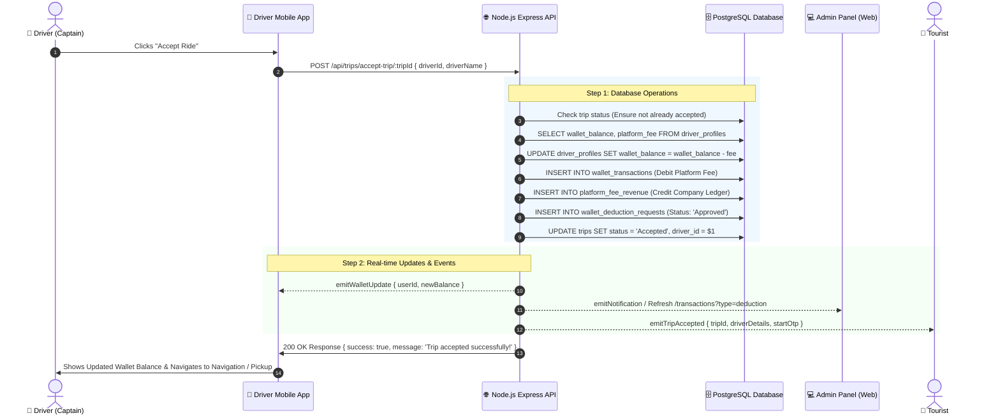

# 🚗 Vibe Platform - Driver Platform Fee Deduction Flow Documentation

Yeh document explain karta hai ki jab koi **Driver (Captain)** Vibe App me ride booking request ko **Accept** karta hai, toh **Platform Fee Deduction** system end-to-end kaise kaam karta hai: real-time wallet debit, database ledger logging, admin panel transactions update, aur live socket synchronization.

---

## 📑 Table of Contents
1. [High-Level Architecture & Workflow](#1-high-level-architecture--workflow)
2. [Sequence Flow Diagram](#2-sequence-flow-diagram)
3. [Step-by-Step Lifecycle Execution](#3-step-by-step-lifecycle-execution)
4. [Platform Fee Calculation Rules](#4-platform-fee-calculation-rules)
5. [Database Schema & Table Changes](#5-database-schema--table-changes)
6. [Real-Time Sockets & Mobile Sync](#6-real-time-sockets--mobile-sync)
7. [Admin Panel Integration](#7-admin-panel-integration)
8. [API Endpoints Reference](#8-api-endpoints-reference)
9. [Edge Cases & Error Handling](#9-edge-cases--error-handling)

---

## 1. High-Level Architecture & Workflow

```
[ Driver Mobile App ] 
         │ (POST /accept-trip/:id ya /respond)
         ▼
[ Vibe Node.js Backend Server ]
   ├── 1. Validates Trip Status (Must be 'Pending'/'Dispatched')
   ├── 2. Calculates Dynamic Platform Fee (Default 10% ya Driver Custom Fee)
   ├── 3. Executes Atomic Database Transactions (PostgreSQL):
   │      ├── 🔻 Debit Driver Wallet Balance (driver_profiles.wallet_balance)
   │      ├── 📝 Insert Debit Record into wallet_transactions
   │      ├── 💰 Record Company Revenue into platform_fee_revenue
   │      ├── 📋 Create Approved Entry in wallet_deduction_requests (for Admin Ledger)
   │      └── 🚗 Update Trip Status to 'Accepted' + Assign Driver & Dynamic OTPs
   └── 4. Broadcasts Real-Time Events (Socket.IO + Push Notifications):
          ├── ⚡ emitWalletUpdate -> Updates Driver Mobile Wallet live without reload
          ├── 🔔 emitNotification -> Instant alert to Admin & Driver
          └── 📲 emitTripAccepted -> Tourist App transitions to Live Tracking Screen
```

---

## 2. Sequence Flow Diagram



---

## 3. Step-by-Step Lifecycle Execution

### Step 1: Driver Accepts the Booking
- Driver mobile app `app/ride-matching.tsx` ya `app/trip-status.tsx` se `acceptTripApi(tripId, driverId, driverName)` trigger hoti hai.
- Payload backend endpoint `POST /api/trips/accept-trip/:id` ya `POST /api/trips/:id/respond` par bheja jaata hai.

### Step 2: Backend Validation & Profile Provisioning
- Backend verify karta hai ki trip pehle se kisi aur driver ne accept toh nahi kar li.
- Driver ka `driver_profiles` check hota hai. Agar driver ka wallet profile pehle se nahi bana ho, toh backend automatically default entry create karke wallet initialize karta hai.

### Step 3: Platform Fee Deduction
- Fare amount ka **10%** (ya custom platform fee) calculate hota hai:
  $$\text{Deduction Amount} = \text{Trip Fare} \times 10\%$$
  *(Example: ₹2,500 ki trip par ₹250 platform fee deduct hoti hai).*
- `driver_profiles.wallet_balance` se yeh amount turant subtract hota hai:
  ```sql
  UPDATE driver_profiles 
  SET wallet_balance = COALESCE(wallet_balance, 0) - $1 
  WHERE user_id::text = $2::text;
  ```

### Step 4: Multi-Ledger Recording (Double-Entry Accounting)
1. **Driver Transaction Record (`wallet_transactions`):**
   - Type: `debit`
   - Category: `Platform Fee`
   - Description: `Platform Fee (10%) for Accepted Trip #<tripId> (<tripTitle>)`
2. **Company Revenue Ledger (`platform_fee_revenue`):**
   - Fee Amount credit hota hai aur company total platform earnings me add hota hai.
3. **Admin Panel Deductions Ledger (`wallet_deduction_requests`):**
   - Status: `Approved`
   - Role: `driver`
   - Description aur trip details store hoti hain.

### Step 5: Real-time Socket Dispatch
- `emitWalletUpdate(driverId, { balance: newBalance })` emit hota hai jisse driver app ka balance bina page reload kiye turant update ho jaata hai.
- `emitTripAccepted(trip)` se Tourist ko Captain assigned ka screen transition hota hai aur OTP dikhai deta hai.

---

## 4. Platform Fee Calculation Rules

| Condition | Rule / Calculation | Example |
| :--- | :--- | :--- |
| **Custom Trip / Outstation** | 10% of total `trip.amount` | Fare = ₹2,500 $\rightarrow$ Platform Fee = **₹250.00** |
| **Fixed City / Station Ride** | Configurable Fixed Fee (e.g. ₹10) or 10% | Fare = ₹150 $\rightarrow$ Platform Fee = **₹15.00** |
| **Hourly Addon Extensions** | 10% on additional addon charges | Addon = ₹400 $\rightarrow$ Additional Fee = **₹40.00** |

---

## 5. Database Schema & Table Changes

### 1. `driver_profiles`
| Column | Type | Description |
| :--- | :--- | :--- |
| `user_id` | `VARCHAR(255)` | Driver User ID |
| `wallet_balance` | `NUMERIC(10,2)` | Current active wallet balance (Debit hone par minus hota hai) |
| `platform_fee` | `NUMERIC(10,2)` | Default fee percentage/rate for driver (Default: 10.00) |

### 2. `wallet_transactions`
| Column | Type | Description |
| :--- | :--- | :--- |
| `id` | `UUID` | Transaction Unique ID |
| `user_id` | `VARCHAR(255)` | Driver ID |
| `type` | `VARCHAR(50)` | `'debit'` |
| `amount` | `NUMERIC(10,2)` | Deducted fee amount (e.g. ₹250.00) |
| `description` | `TEXT` | Trip reference & percentage note |
| `trip_id` | `VARCHAR(255)` | Associated Trip ID |
| `created_at` | `TIMESTAMP` | Transaction timestamp |

### 3. `wallet_deduction_requests` (Admin Panel Ledger)
| Column | Type | Description |
| :--- | :--- | :--- |
| `id` | `UUID` | Request Record ID |
| `user_id` | `VARCHAR(255)` | Driver ID |
| `user_name` | `VARCHAR(255)` | Driver full name (e.g. Suresh Driver) |
| `role` | `VARCHAR(50)` | `'driver'` |
| `amount` | `NUMERIC(10,2)` | Platform Fee amount |
| `description` | `TEXT` | `Platform Fee (10%) for Accepted Trip #...` |
| `status` | `VARCHAR(50)` | **`'Approved'`** (Instant Auto-Approved) |
| `trip_id` | `VARCHAR(255)` | Trip ID |
| `requested_at`| `TIMESTAMP` | Timestamp of acceptance |

---

## 6. Real-Time Sockets & Mobile Sync

Backend `backend/config/socket.js` se real-time updates bhejta hai:

1. **`emitWalletUpdate` Event:**
   ```javascript
   io.emit('wallet_updated', {
     userId: driverId,
     walletBalance: updatedBalance,
     currency: 'INR',
     timestamp: new Date().toISOString()
   });
   ```
   *Driver App me `subscribeWalletChange()` listener turant UI top bar aur wallet card me updated amount display karta hai.*

2. **`emitNotification` Event:**
   - Admin panel audio alert sound play karta hai aur transactions tab par notification count increase hota hai.

---

## 7. Admin Panel Integration

- **URL:** [https://vibe-neon-three.vercel.app/transactions?type=deduction](https://vibe-neon-three.vercel.app/transactions?type=deduction)
- **Features on Page:**
  - **Deductions (Platform Fee) Tab:** Sabhi auto-approved platform fee deductions live table me dikhti hain.
  - **Details Displayed:** Driver Name, Vehicle Number, Vehicle Model, Trip Title, Deducted Fee Amount (e.g. ₹250), Driver Remaining Wallet Balance, aur Timestamp.
  - **Status Badge:** Green `Approved` badge.

---

## 8. API Endpoints Reference

### 1. Driver Accepts Trip
- **Method:** `POST`
- **Path:** `/api/trips/accept-trip/:id` (Alias: `/api/trips/:id/accept` ya `/api/trips/:id/respond`)
- **Request Body:**
  ```json
  {
    "driverId": "d1",
    "driverName": "Suresh Driver"
  }
  ```
- **Response (200 OK):**
  ```json
  {
    "success": true,
    "message": "Trip accepted successfully!",
    "data": {
      "id": "b423c16a-caeb-4ab7-a9eb-994d37c1b2a8",
      "status": "Accepted",
      "driverId": "d1",
      "driverName": "Suresh Driver",
      "amount": "2500.00",
      "startOtp": "3898",
      "endOtp": "4236"
    }
  }
  ```

### 2. Admin Fetch Deductions Ledger
- **Method:** `GET`
- **Path:** `/api/admin/wallet/deduction-requests?status=All`
- **Response (200 OK):**
  ```json
  {
    "success": true,
    "data": [
      {
        "id": "266bcb98-99af-4fc2-ae36-75ec6d6655f6",
        "user_id": "d1",
        "user_name": "Suresh Driver",
        "role": "driver",
        "amount": "250.00",
        "status": "Approved",
        "current_wallet_balance": "750.00",
        "vehicle_number": "KA-03-EX-8240",
        "trip_title": "Sakleshpur Heritage Coffee Tour",
        "requested_at": "2026-08-21T14:56:15.843Z"
      }
    ]
  }
  ```

---

## 9. Edge Cases & Error Handling

1. **UUID vs String ID Compatibility:**
   - Sabhi database queries explicit text cast `user_id::text = $1::text` aur `CAST(id AS VARCHAR)` use karti hain, jisse numeric IDs, custom string IDs (`d1`), ya UUIDs (`660aa253-...`) bina kisi SQL crash ke smoothly execute hote hain.
2. **Double Acceptance Protection:**
   - Agar do drivers ek hi time par same ride accept karne ki koshish karein, toh database check karta hai `WHERE LOWER(status) IN ('pending', 'requested')`. Pehla driver accept karega aur doosre ko `"Trip already accepted by another Captain"` return hoga.
3. **Zero / Low Wallet Balance:**
   - Agar driver ka balance ₹0 ho, tab bhi deduction transaction record hota hai aur wallet negative balance show karta hai (Credit Line), jise driver baad me recharge kar sakta hai.

---

*Documentation maintained by Vibe Engineering Team.*
